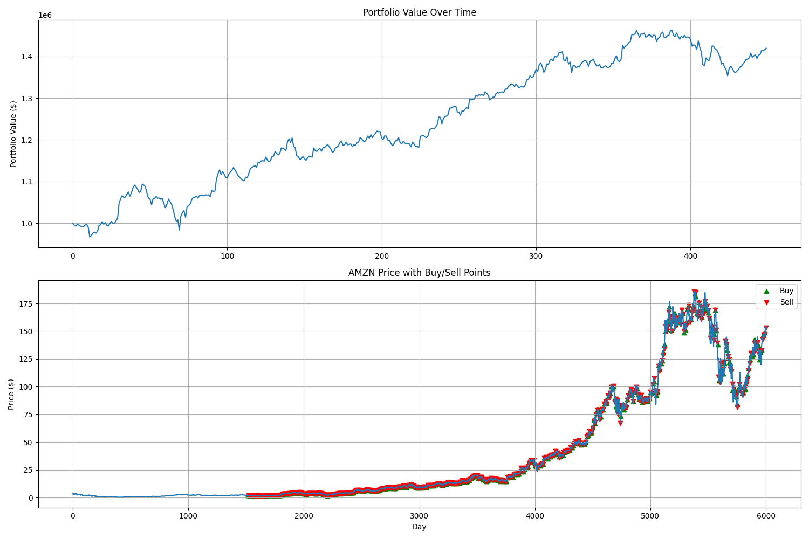

# Deep Reinforcement Learning for Algorithmic Trading

A robust framework for applying deep reinforcement learning techniques to algorithmic trading. This project implements various reinforcement learning algorithms to optimize trading strategies in financial markets.

## Performance Highlights

**Backtest Results:**
- Initial Capital: $1,000,000.00
- Final Capital: $1,419,916.47
- Total Return: 41.99%
- Total Profit/Loss: $419,916.47
- Number of Trades: 449
- Win Rate: 55.90%



## Overview

This project applies deep reinforcement learning algorithms to financial trading, framing the trading process as a sequential decision-making problem. The framework includes:

- Multiple reinforcement learning algorithms (DQN, PPO, TDQN)
- Customizable trading environments
- Feature engineering and data processing pipeline
- Backtesting system for strategy evaluation
- Various trading strategy implementations

## Project Structure

```
reinforcement_learning/
├── data/
│   ├── raw/                     # Raw financial data
│   └── processed/               # Processed features
├── src/
│   ├── data/                    # Data processing modules
│   ├── environment/             # Trading environments 
│   ├── evaluation/              # Backtesting and evaluation
│   ├── training/                # Training algorithms
│   └── utils/                   # Utility functions
├── models/                      # Saved models
├── results/                     # Backtest results
│   ├── figures/                 # Performance visualizations
│   └── trade_history/           # Detailed trade logs
├── logs/                        # Training logs
└── checkpoints/                 # Training checkpoints
```

## Installation

```bash
# Clone the repository
git clone https://github.com/Eddiefans/reinforcement_learning.git
cd reinforcement_learning

# Create a virtual environment (optional but recommended)
python -m venv venv
source venv/bin/activate  # On Windows: venv\Scripts\activate

# Install dependencies
pip install -r requirements.txt

# Install PyTorch (CPU version)
pip install -r torch-requirements.txt
```

## Getting Started

### 1. Data Processing

Download and process financial data:

```bash
python src/data/processor.py
```

This will:
- Download historical data for the specified ticker (default: AMZN)
- Calculate technical indicators and features
- Save processed data to `data/processed/`

### 2. Training a Model

Train a reinforcement learning agent:

```bash
python src/training/train.py
```

Options:
- `--data_path`: Path to processed data
- `--total_timesteps`: Number of training steps
- `--ttl`: Time to live for trading decisions
- `--window_size`: Observation window size

### 3. Backtesting

Evaluate your trained model:

```bash
python src/evaluation/backtest.py
```

This generates detailed performance metrics, trade history, and visualizations.

## Implemented Algorithms

- **DQN (Deep Q-Network)**: Classic value-based deep RL algorithm
- **PPO (Proximal Policy Optimization)**: Policy gradient method with stable training
- **TDQN (Trading Deep Q-Network)**: Custom DQN variant optimized for trading tasks with features like:
  - Experience replay
  - Double Q-learning
  - Dueling network architecture
  - Data augmentation techniques

## Trading Environments

The project includes several trading environment implementations:

- **TradingEnv**: Standard environment with continuous trading
- **TTLTradingEnv**: Time-To-Live environment where decisions are made at fixed intervals

Each environment follows the OpenAI Gym interface and provides:
- Customizable observation space
- Flexible reward functions
- Transaction cost modeling
- Performance tracking

## Citation

If you use this code in your research, please cite:

```
@misc{RL_Trading,
  author = {Eddiefans},
  title = {Deep Reinforcement Learning for Algorithmic Trading},
  year = {2025},
  publisher = {GitHub},
  url = {https://github.com/Eddiefans/reinforcement_learning}
}
```

## License

This project is licensed under the MIT License - see the LICENSE file for details.

## Acknowledgements

This project draws inspiration from:
- "Human-level control through deep reinforcement learning" by Mnih et al.
- "Continuous control with deep reinforcement learning" by Lillicrap et al.
- "Application of Deep Reinforcement Learning to Algorithmic Trading" by Théate and Ernst
- "Financial Trading as a Game: A Deep Reinforcement Learning Approach" by Huang
